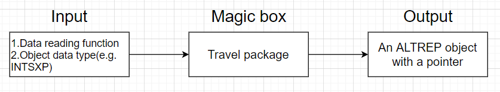
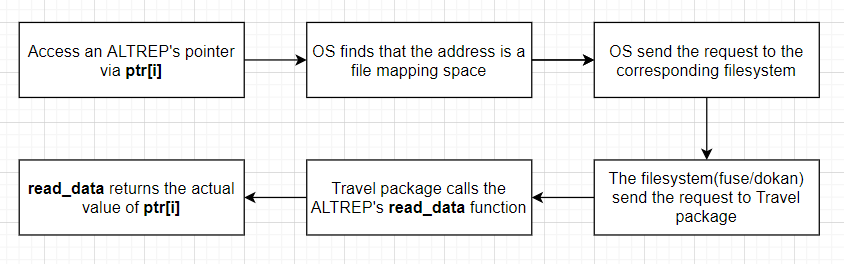

# Introduction
## ALTREP
ALTREP is a relatively new feature that has been released since R3.5. It stands for alternative representation of R's vector object. ALTREP is capable to create an R vector with a customized data structure. The difference between ALTREP and vector is opaque to R users. The main motivation of the ALTREP is to reduce the memory load when creating some special vector. Consider the example

```r
x <- 1:(1024*1024*1024*1024)
length(x)
#> [1] 1099511627776
typeof(x)
#> [1] "double"
```
You might think the above crazy code will exhaust all the memory in your machine and burn your computer into ash. However, if you are using any version of R that is equal or newer than 3.5, the code works like a charm. You can access the data of `x` as usual

```r
head(x)
#> [1] 1 2 3 4 5 6
```
You might have a guess on what has happened here. Storing the data of the vector `x` in memory is clearly not a good idea. Since it is an arithmetic sequence, you only need to know the first item and the common difference to compute every values in `x`. As long as you do not need the entire data at once, you do not have to put all data into your memory. A minimum ALTREP object can be made by defining a length function and an element retrieving function at C level, the function prototypes are
```{}
R_xlen_t length(SEXP x);
double real_elt(SEXP x, R_xlen_t i);
```
We wouldn't go into the details of the ALTREP but you can have an intuition on how ALTREP works with these two functions. If you are interested in this topic, here are two videos for the ALTREP:

1. [Developers Forum 16](https://www.youtube.com/watch?v=8i7ziLqsE2s&t=269s&ab_channel=Bioconductor): ALTREP basics
2. [Developers Forum 17](https://www.youtube.com/watch?v=biygNnJA1oY&ab_channel=Bioconductor): ALTREP basics and the design of the Travel package

Documents are also available:

1. [ALTREP and Other Things](https://www.r-project.org/dsc/2017/slides/dsc2017.pdf): A review of the structure of ALTREP
2. [ALTREP and C++](https://purrple.cat/blog/2018/10/14/altrep-and-cpp/): A tutorial of ALTREP with  examples. It helps me a lot when I first saw the idea of ALTREP

## Challenge with ALTREP
Although the idea of the ALTREP sounds exciting as it greatly extends the flexibility of R's vector, it breaks the assumption that all R's vectors have a pointer associated with them. While today's R developers might be aware of it(or not?), many packages were developed before ALTREP and their work depends on this assumption. Before R3.5, It is very common to loop over the data of R's vector at C level like 
```
double my_sum(SEXP x){
  double* ptr = (double*)DATAPTR(x);
  double total = 0;
  for(int i = 0; i < XLENGTH(x); ++i){
    total = total + ptr[i];
  }
  return total;
}
```
The above code works fine for a regular R vector since its data has been allocated in the memory. However, for an ALTREP object, as it might not have a pointer, it only has two options when `DATAPTR` is called:

1. Allocating the data in memory and return the pointer of the data
2. Call `Rf_error` to throw an error message.

While the first one seems to be a good choice, it is actually not always feasible in practice for the object might be larger than the available memory(As the crazy vector example we saw previously). The second choice can be used if a pointer cannot be given, but it prevents the ALTREP object from being used by many old but useful packages. Also, it might causes memory leaking for the objects allocated in heap prior to the call of `DATAPTR` may not have a chance to release themselves. For an arithmetic sequence in the first example, it actually adopt both strategies: It will allocate the memory for a short sequence, but throw an error for a large sequence. For example

```r
## Short sequence
x1 <- 1:10
x1[1] <- 10 
head(x1)
#> [1] 10  2  3  4  5  6

## long sequence 
x2 <- 1:(64*1024*1024*1024)
x2[1] <- 10
#> Error: cannot allocate vector of size 512.0 Gb
```
As of R4.1, every attempt to change the values of an R vector will require to access the pointer of the vector. For a short sequence this can be easily solved via the memory allocation. However, for a large sequence, since there would not be enough space for a 8192Gb vector, doing so will end up with an error message. 
Requiring the pointer from an ALTREP object has been a very serious limitation that prevents it from being used in practice to represent a large data. That is the problem that the Travel package is intended to solve.

## Travel package


Travel package is an utility for developers to build ALTREP objects with a virtual pointer. The pointer of the ALTREP object can be accessed via the regular `DATAPTR` function in `Rinternals.h` at C level. The basic workflow of using the package is



The pointer is "virtual" in the sense that the data does not exist in the memory before one actually try to access the data. The pointer is made via File mapping, but it wouldn't consume any disk space neither for the file being mapped is also a virtual file. All the request to access the file will be sent to Travel callback functions and then delivered to user provided data reading function. Suppose we have made an ALTREP object with the data reading function `read_data`. Let the pointer of the ALTREP object be `ptr`. Here is what happens behind the scenes when you want to read the `i`th element of the pointer



As we see from the flowchart, the data of the pointer `ptr` is made on-demand. The pointer would not exhaust the memory even if it points to an extremely large object. By doing that we solve the main limitation of the ALTREP. The pointer of the ALTREP object can be accessed in a usual way, and the memory consumption is minimum. Take the super large sequence as an example again, the package provides a wrapper function to turn an old ALTREP object into a new ALTREP object with a virtual pointer. 

```r
x <- 1:(64*1024*1024*1024)
y <- wrap_altrep(x)

x[1:10]
#>  [1]  1  2  3  4  5  6  7  8  9 10
y[1:10]
#>  [1]  1  2  3  4  5  6  7  8  9 10
```
While `x` and `y` looks the same, the pointer of `y` can be accessed as usual

```r
x[1] <- 10
#> Error: cannot allocate vector of size 512.0 Gb
x[1:10]
#>  [1]  1  2  3  4  5  6  7  8  9 10

y[1] <- 10
y[1:10]
#>  [1] 10  2  3  4  5  6  7  8  9 10
```
Furthermore, loop over the sequence `y` works as expected.


```r
## We only compute the sum of the first 10 elements
code <- 
'
  double* ptr = (double*)DATAPTR(x);
  double total = 0;
    for(int i = 0; i < 10; ++i){
    total = total + ptr[i];
    }
  return ScalarReal(total);
'
my_sum <- inline::cxxfunction(signature(x="SEXP"),
                    body=code)

## An error will be given for x
my_sum(x)
#> Error: cannot allocate vector of size 512.0 Gb
## No error will be given and the sum can be computed
my_sum(y)
#> [1] 64
```
Please note that the wrapper function `wrap_altrep` should be used with caution for it will call R's function in a multithreaded environment. As R is known to be a single-thread program, it is not recommended to use this function in practice. `wrap_altrep` should be called for demonstration purpose only. In the next section, we will show you how to formally build your own ALTREP object using Travel package.

# Travel tutorial
## Dependencies
There are a few dependencies you need to install for using the package.

For *Windows*:

1. [Dokan](https://dokan-dev.github.io/)

It is recommended to download `DokanSetup-noVC.exe` for this is the library that the Travel package has been tested with. 

For *Linux* and *Mac*:

1. [fuse](https://github.com/libfuse/libfuse)
2. [pkg-config]()


## Use Travel
Travel is written by C++, for making the Travel header available, you need to add `Travel` to the `LinkingTo` field of the DESCRIPTION file, e.g.
```
LinkingTo: Travel
```
The main function of the Travel package is `Travel_make_altrep`, its function declaration is as follows
```
SEXP Travel_make_altrep(Travel_altrep_info altrep_info);
```
where `Travel_altrep_info` is a struct containing the information of the ALTREP object. The definition of `Travel_altrep_info` is
```
struct Travel_altrep_info
{
  Travel_altrep_operations operations;
  int type = 0;
  uint64_t length = 0;
  void *private_data = nullptr;
  SEXP protected_data = R_NilValue;
};
```
`type` specifies the vector type(e.g. `LGLSXP`, `INTSXP` or `REALSXP`), `length` is the length of the vector. `private_data` is a pointer for developers to store any data that is opaque to the Travel package. `protected_data` is used to make sure the source of the ALTREP(if any) will not be released before the ALTREP object is released. `operations` is a struct which defines the `ALTREP` operations, its design is similar to the ALTREP's API. The definition of the stuct is
```
struct Travel_altrep_operations
{
  Travel_get_region get_region = NULL;
  Travel_read_blocks read_blocks = NULL;
  Travel_set_region set_region = NULL;
  Travel_get_private_size get_private_size = NULL;
  Travel_extract_subset extract_subset = NULL;
  Travel_duplicate duplicate = NULL;
  Travel_coerce coerce = NULL;
  Travel_serialize serialize = R_NilValue;
  Travel_unserialize unserialize = R_NilValue;
  Travel_inspect_private inspect_private = NULL;
};
```
Even though the definition looks complicated, only the function `get_region` is required to make the ALTREP works. The function `get_region` is the core function for an ALTREP object because Travel package uses it to obtain data from the ALTREP. Its prototype is 
```
typedef size_t (*Travel_get_region)(const Travel_altrep_info *altrep_info, void *buffer,
                                    size_t offset, size_t length);
```
where `altrep_info` is the struct we mentioned previously. `buffer` is the buffer that will hold the requested data. `offset` is the 0-based offset of the vector element that the read should start. `length` is the number of the vector elements that is requested starting from `offset`. Each call to `Travel_get_region` will read a consecutive data in the vector. The read result should be written back to `buffer` and the length of the read should be returned by the function. For the other functions, please refer to the header file `Travel_package_types.h`. 

Besides the ALTREP creation function, the package also provides a smart pointer to ease the development of the ALTREP. The prototypes of the smart pointer are
```
template <typename T>
SEXP Travel_shared_ptr(T ptr, SEXP tag = R_NilValue, SEXP prot = R_NilValue);
template <typename T>
SEXP Travel_shared_ptr(T *ptr, SEXP tag = R_NilValue, SEXP prot = R_NilValue);
```
The return value of `Travel_shared_ptr` is R's external pointer object and its lifespan is controlled by R's Garbage collector. Once the external pointer is released, it will free up the space that is pointed by the pointer `ptr`. Here are two examples of using the smart pointer
```
SEXP extPtr = Travel_shared_ptr<int>(new int);
SEXP extPtrArray = Travel_shared_ptr<int[]>(new int[10]);
```
The smart pointer can be used to release your `private_data` after the ALTREP object is released. Combining all these functions together, we can make a simple arithmetic sequence with any step value in R. Here are the code snippet for the example. The full example can be found at [TravelExample](https://github.com/Jiefei-Wang/TravelExample) 
```
#include <Rcpp.h>
#include "Travel/Travel.h"
using namespace Rcpp;

struct Seq_info{
  size_t start;
  size_t step;
  ~Seq_info(){
    Rprintf("I am called from GC\n");
  }
};

// The data reading function
size_t read_sequence(const Travel_altrep_info* altrep_info, void *buffer, size_t offset, size_t length)
{
  Seq_info* info = (Seq_info*)altrep_info->private_data;
  for (size_t i = 0; i < length; i++)
  {
    ((double *)buffer)[i] = info -> start + info -> step * (offset + i);
  }
  return length;
}

// The main ALTREP making function
// [[Rcpp::export]]
SEXP make_sequence_altrep(size_t n, size_t start, size_t step)
{
  Seq_info* info = new Seq_info{start, step};
  Travel_altrep_info altrep_info = {};
  altrep_info.length = n;
  altrep_info.type = REALSXP;
  altrep_info.operations.get_region = read_sequence;
  altrep_info.private_data = info;
  altrep_info.protected_data = Rf_protect(Travel_shared_ptr<Seq_info>(info));
  SEXP x = Rf_protect(Travel_make_altrep(altrep_info));
  Rf_unprotect(2);
  return x;
}
```
Here is the output from the example package
```
> x <- make_sequence_altrep(n = 1024*1024*1024*64, start = 1, step = 2)
> length(x)
[1] 68719476736
> x[1:10]
 [1]  1  3  5  7  9 11 13 15 17 19
> x[1] <- 100
> x[1:10]
 [1] 100   3   5   7   9  11  13  15  17  19
> 
> rm(x)
> gc()
I am called from GC
          used (Mb) gc trigger (Mb) max used (Mb)
Ncells  819800 43.8    1487236 79.5  1487236 79.5
Vcells 1863208 14.3    8388608 64.0  2630899 20.1
```
Now you get a vector `x` with a crazy size, all operations of the ALTREP can be supported. Enjoy the full power of the ALTREP objects!

# Session info

```r
sessionInfo()
#> R Under development (unstable) (2020-09-03 r79126)
#> Platform: x86_64-w64-mingw32/x64 (64-bit)
#> Running under: Windows 10 x64 (build 19041)
#> 
#> Matrix products: default
#> 
#> locale:
#> [1] LC_COLLATE=English_United States.1252 
#> [2] LC_CTYPE=English_United States.1252   
#> [3] LC_MONETARY=English_United States.1252
#> [4] LC_NUMERIC=C                          
#> [5] LC_TIME=English_United States.1252    
#> 
#> attached base packages:
#> [1] stats     graphics  grDevices utils     datasets  methods   base     
#> 
#> other attached packages:
#> [1] inline_0.3.16 Travel_0.99.0
#> 
#> loaded via a namespace (and not attached):
#> [1] compiler_4.1.0 magrittr_1.5   tools_4.1.0    Rcpp_1.0.5     stringi_1.5.3 
#> [6] knitr_1.30     stringr_1.4.0  xfun_0.19      evaluate_0.14
```


